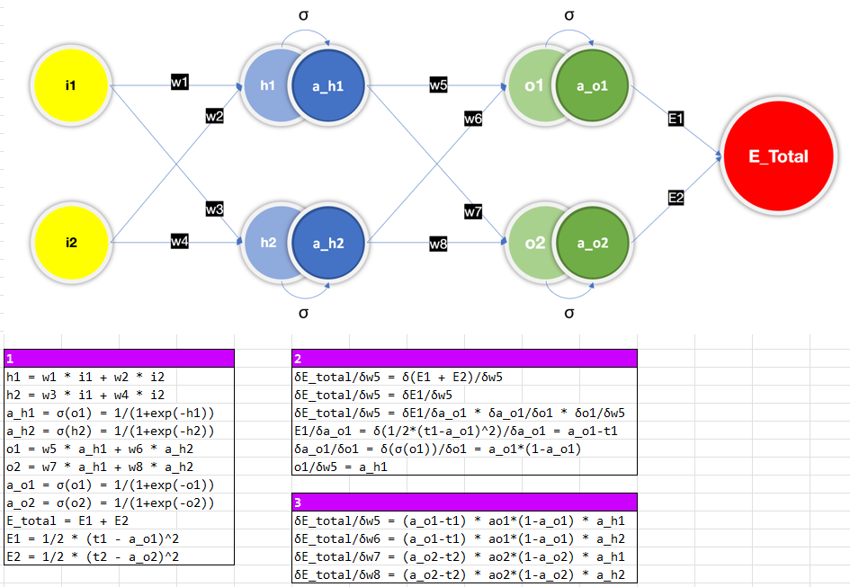

# EVA8_S3_BackPropagation
Back Propagation in Excel

# Step 1
According to the figure of the neural network, list all the relationships/equations between each neuron.  
* h1 = w1 * i1 + w2 * i2  
* h2 = w3 * i1 + w4 * i2  
* a_h1 = σ(o1) = 1/(1+exp(-h1))  
* a_h2 = σ(h2) = 1/(1+exp(-h2))  
* o1 = w5 * a_h1 + w6 * a_h2  
* o2 = w7 * a_h1 + w8 * a_h2  
* a_o1 = σ(o1) = 1/(1+exp(-o1))  
* a_o2 = σ(o2) = 1/(1+exp(-o2))  
* E_total = E1 + E2  
* E1 = 1/2 * (t1 - a_o1)^2   
* E2 = 1/2 * (t2 - a_o2)^2  
  

# Step 2
Take partial derivative of E_total for w5, with chain rule, list every equation.
* δE_total/δw5 = δ(E1 + E2)/δw5  
* δE_total/δw5 = δE1/δw5  
* δE_total/δw5 = δE1/δa_o1 * δa_o1/δo1 * δo1/δw5  
* E1/δa_o1 = δ(1/2*(t1-a_o1)^2)/δa_o1 = a_o1-t1  
* δa_o1/δo1 = δ(σ(o1))/δo1 = a_o1*(1-a_o1)  
* o1/δw5 = a_h1  
