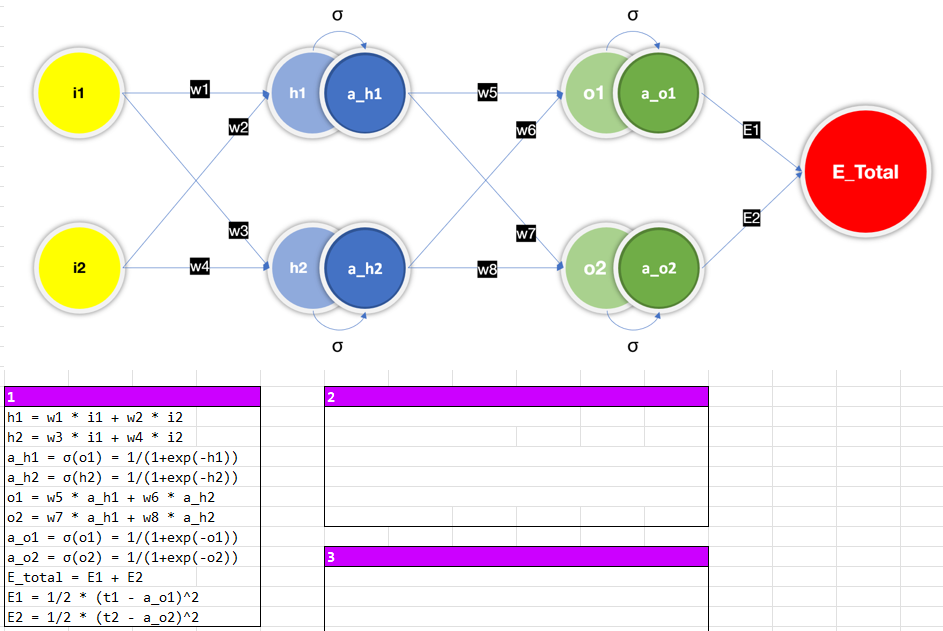

# EVA8_S3_BackPropagation
Back Propagation in Excel

# Step 1
According to the figure of the neural network, list all the relationships/equations between each neuron.  
* h1 = w1 * i1 + w2 * i2  
* h2 = w3 * i1 + w4 * i2  
h1 and h2 are the first layer neurons, from the weights time i1 and i2.
* a_h1 = σ(o1) = 1/(1+exp(-h1))  
* a_h2 = σ(h2) = 1/(1+exp(-h2))  
Activation function, sigmoid, is applied to h1 to get a_h1.
* o1 = w5 * a_h1 + w6 * a_h2  
* o2 = w7 * a_h1 + w8 * a_h2  
o1 and o2 are the 2nd layer neurons, from wht weights time a_h1 and a_h2.
* a_o1 = σ(o1) = 1/(1+exp(-o1))  
* a_o2 = σ(o2) = 1/(1+exp(-o2))  
Activation function, sigmoid, is applied to o1 to get a_o1.
* E_total = E1 + E2  
* E1 = 1/2 * (t1 - a_o1)^2   
* E2 = 1/2 * (t2 - a_o2)^2  
The erro function is then calculated and sum to E_total.
  

# Step 2
Take partial derivative of E_total for w5, with chain rule, list every equation.
* δE_total/δw5 = δ(E1 + E2)/δw5  
* δE_total/δw5 = δE1/δw5  
* δE_total/δw5 = δE1/δa_o1 * δa_o1/δo1 * δo1/δw5  
Chain rule to get δE_total/δw5
* E1/δa_o1 = δ(1/2*(t1-a_o1)^2)/δa_o1 = a_o1-t1  
* δa_o1/δo1 = δ(σ(o1))/δo1 = a_o1*(1-a_o1)  
* o1/δw5 = a_h1  
Above three equations are from calculation of differentiation.
  
# Step 3
Use chain rule to calculate partial derivative E_total of w5, w6, w7, and w8.  
* δE_total/δw5 = (a_o1-t1) * ao1*(1-a_o1) * a_h1  
* δE_total/δw6 = (a_o1-t1) * ao1*(1-a_o1) * a_h2  
* δE_total/δw7 = (a_o2-t2) * ao2*(1-a_o2) * a_h1  
* δE_total/δw8 = (a_o2-t2) * ao2*(1-a_o2) * a_h2  
  

  
# Step 4
Taking partial derivative of E1 and E2 respective to a_h1.  
δE_total/δa_h1 is adding previous two term together.  
We can repeat the same calculation for δE_total/δa_h2.    
* δE1/δa_h1 = (a_o1-t1) * a_o1*(1-a_o1) * w5  
* δE2/δa_h1 = (a_o2-t2) * a_o2*(1-a_o2) * w7  
* δE_total/δa_h1 = (a_o1-t1) * ao_o1*(1-a_o1) * w5 + (a_o2-t2) * a_o2*(1-a_o2) * w7  
* δE_total/δa_h2 = (a_o1-t1) * ao_o1*(1-a_o1) * w6 + (a_o2-t2) * a_o2*(1-a_o2) * w8  
  

# Step 5
Based on previous calculation, we can further utilize the chain rule to list the E_total’s partial derivative of w1, w2, w3, and w4.  
* δE_total/δw1 = δE_total/δa_h1 * δa_h1/δh1 * δh1/δw1  
* δE_total/δw2 = δE_total/δa_h1 * δa_h1/δh1 * δh1/δw2  
* δE_total/δw3 = δE_total/δa_h1 * δa_h1/δh1 * δh1/δw3  
* δE_total/δw4 = δE_total/δa_h1 * δa_h1/δh1 * δh1/δw4  

# Step 6
Extend the chain rule to replace every element in step 5 to calculate the partial derivative of w1, w2, w3, and w4. Like the process in step 3.  
δE_total/δw1 = ((a_o1-t1) * ao_o1*(1-a_o1) * w5 + (a_o2-t2) * a_o2*(1-a_o2) * w7) * a_h1*(1-a_h1) * i1  
δE_total/δw2 = ((a_o1-t1) * ao_o1*(1-a_o1) * w5 + (a_o2-t2) * a_o2*(1-a_o2) * w7) * a_h1*(1-a_h1) * i2  
δE_total/δw3 = ((a_o1-t1) * ao_o1*(1-a_o1) * w6 + (a_o2-t2) * a_o2*(1-a_o2) * w8) * a_h1*(1-a_h1) * i1  
δE_total/δw4 = ((a_o1-t1) * ao_o1*(1-a_o1) * w6 + (a_o2-t2) * a_o2*(1-a_o2) * w8) * a_h1*(1-a_h1) * i2  
  
# Step 7
Adding E1 and E2 to show the total loss.  
Plot the figure to to show Loss vs training steps, steps as x-axis.  
  

We can further tune the learning rate:  η  
By changing the learning rate, we can see the higher the learning rate, the quicker the loss converge.  
  

  
The higher doesn't mean the quicker converge.  
In another case that learning rate is too high, like 200, the training was acutally getting worse, since the weight is updating too much and too quick.  
case: (t1, t2) is changed from (0.1, 0.9) to (0.3, 0.7)  
  

